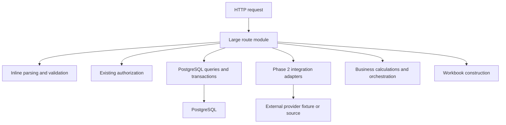
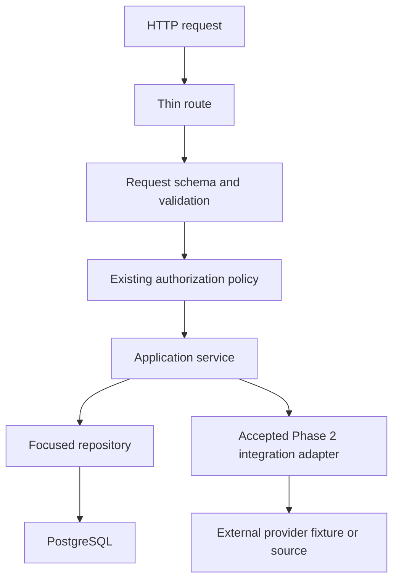

# Phase 3 Service and Repository Boundary Report

Status: **local implementation and acceptance verification complete; ready for
Phase 3 acceptance review**.

This was a structural refactor only. It was performed on
`refactor/phase-3-service-repository-boundaries` in an isolated worktree. All
database-backed verification used the disposable local database
`backend_tracker_phase3_test_20260816`. No Production or staging database was
used. Nothing was pushed, merged, or deployed.

## 1. Phase 2 baseline commit

- Accepted commit: `1234543cd9b4ff2314887e9e61ab4b00439b50ad`.
- Accepted tag: `phase-2-source-adapters-2026-08-16`.
- Every comparison in this report uses that accepted tree or its accepted
  Phase 2 acceptance addendum. Golden outputs and performance thresholds were
  not recaptured to accommodate Phase 3.

## 2. Final Phase 3 implementation commit

- Final runtime implementation tip:
  `2c990d17c10ebd89d938e19b578d59b716621e04`.
- The documentation commit containing this report is intentionally not embedded
  in the report because its SHA is self-referential; it changes no runtime code.
- Baseline through implementation: 45 focused commits, 112 changed files,
  13,823 insertions, and 6,695 deletions.
- The last domain commit is
  `2c990d1 refactor(users): isolate administration service and persistence`.

## 3. Domains refactored

The selected domains were completed in the requested risk order:

1. Retention: Google Sheets, ReadyMode statistics, QUO statistics/live/calls,
   and PBX-backed statistics.
2. Attendance: reads, imports, call reporting, record/member mutations, and
   persistence.
3. QA: validation, authorization, evaluation, durable jobs, reporting,
   persistence, manual evaluation, and export construction.
4. VoS / Customer Support / PBX-backed reporting: dashboard composition,
   missed-call reports, callback review, no-callback workflow, provider scans,
   refresh, diagnostics, durable state, and persistence.
5. NSF: ReadyMode queue schemas, service orchestration, persistence, and command
   behavior.
6. Onboarding: analytics persistence, report persistence, and report provider
   access behind the existing application modules.
7. Live Transfers: persistence and provider interaction behind the existing
   application module.
8. Violations: schemas, calculations, service orchestration, authorization
   timing, verification attribution, and persistence.
9. User Administration: account policy, safe output mapping, transactional
   persistence, password metadata, and session revocation.

## 4. Routes moved behind boundaries

No public route, method, path, response shape, or status contract moved. Logic
behind these route modules moved into domain boundaries:

- `routes/sheets.ts`: Retention Sheets validation, service, and repository.
- `routes/readymode.ts`: Retention ReadyMode statistics service; import/probe
  operations continue to use accepted Phase 2 adapters.
- `routes/quo.ts`: Retention QUO statistics, calls, live, and refresh services.
- `routes/vos.ts`: PBX dashboard, reporting, refresh, diagnostics, and state
  services.
- `routes/attendance.ts`: Attendance application, call, authorization, source,
  and repository boundaries.
- `routes/qa.ts`: QA schemas, authorization, application services,
  repositories, integrations, and export service.
- `routes/nsfReadymode.ts`: NSF ReadyMode schemas and service.
- `routes/obAnalytics.ts` and `routes/obReport.ts`: existing application modules
  now call focused repositories/providers.
- `routes/liveTransfers.ts`: existing application module now calls focused
  repository/provider boundaries.
- `routes/violations.ts`: Violations schema and service.
- `routes/users.ts`: User Administration service and repository.

`routes/quoWebhook.ts` stayed in the inventory but was deliberately not
restructured; section 22 explains why.

## 5. Services created

The following framework-independent application services were added. They take
explicit inputs and do not depend on Express `Request` or `Response`:

- Retention: `retention.service.ts`, `retention.readymode.service.ts`,
  `retention.quo.service.ts`, `retention.quo.live.service.ts`,
  `retention.quo.calls.service.ts`, and `retention.pbx.service.ts`.
- Attendance: `attendance.service.ts` and `attendance.calls.service.ts`.
- QA: `qa.evaluation.service.ts`, `qa.jobs.service.ts`,
  `qa.reporting.service.ts`, `qa.manual.service.ts`, and
  `qa.export.service.ts`.
- PBX: `pbx.dashboard.service.ts`, `pbx.diagnostics.service.ts`,
  `pbx.missed.service.ts`, `pbx.no-callback.service.ts`,
  `pbx.provider.service.ts`, and `pbx.refresh.service.ts`.
- NSF: `nsf.readymode.service.ts`.
- Violations: `violations.service.ts` plus the pure
  `violations.calculations.ts` helper.
- User Administration: `users.service.ts`.

The established Onboarding and Live Transfer application modules were retained
instead of being renamed solely for aesthetics. Their persistence and provider
responsibilities were extracted beneath them.

## 6. Repositories created

Focused PostgreSQL boundaries added during Phase 3:

- Retention: `retention.repository.ts`, `retention.quo.repository.ts`,
  `retention.quo.live.repository.ts`, and `retention.pbx.repository.ts`.
- Attendance: `attendance.repository.ts`.
- QA: `qa.repository.ts`.
- PBX: `pbx.missed.repository.ts`, `pbx.no-callback.repository.ts`, and
  `pbx.refresh.repository.ts`.
- NSF: `nsf.readymode.repository.ts`.
- Onboarding: `onboarding.analytics.repository.ts` and
  `onboarding.report.repository.ts`.
- Live Transfers: `liveTransfers.repository.ts`.
- Violations: `violations.repository.ts`.
- User Administration: `users.repository.ts`.

Repositories remain domain-focused. No generic database repository was added,
and no repository calls a provider.

## 7. Before and after dependency diagrams

### Before



### After for migrated flows



The route remains responsible for HTTP compatibility and known error mapping.
The service owns orchestration. Repositories own database access. Existing
integration adapters remain the accepted provider transport/parsing boundary.

## 8. Before and after route LOC

LOC uses the same PowerShell `Get-Content | Measure-Object -Line` method on the
accepted baseline and final implementation.

| Route file | Phase 2 LOC | Phase 3 LOC | Change |
| --- | ---: | ---: | ---: |
| `sheets.ts` | 172 | 76 | -96 |
| `readymode.ts` | 392 | 150 | -242 |
| `quo.ts` | 1,204 | 574 | -630 |
| `quoWebhook.ts` | 355 | 355 | 0; deliberately frozen |
| `vos.ts` | 1,769 | 126 | -1,643 |
| `attendance.ts` | 787 | 231 | -556 |
| `qa.ts` | 1,084 | 268 | -816 |
| `nsfReadymode.ts` | 201 | 79 | -122 |
| `obAnalytics.ts` | 47 | 47 | 0; logic extracted below route |
| `obReport.ts` | 107 | 107 | 0; logic extracted below route |
| `liveTransfers.ts` | 60 | 60 | 0; logic extracted below route |
| `violations.ts` | 450 | 71 | -379 |
| `users.ts` | 488 | 71 | -417 |
| **Total** | **7,116** | **2,215** | **-4,901 (-68.9%)** |

The remaining 574-line QUO route contains several operational and compatibility
paths not selected for risky late-stage movement; its primary stats, calls, and
live dashboard paths now delegate to services.

## 9. Largest remaining backend files

Current production TypeScript, excluding tests:

| File | LOC | Classification |
| --- | ---: | --- |
| `routes/samia.ts` | 1,727 | deliberately frozen AI/chat domain |
| `modules/onboarding/analytics.ts` | 819 | existing application/report calculation module |
| `integrations/quo/sync.ts` | 630 | accepted Phase 2 integration |
| `routes/quo.ts` | 574 | mixed retained operational compatibility paths |
| `modules/transfers/liveTransfers.ts` | 494 | existing application/classification module |
| `modules/onboarding/report.ts` | 463 | existing application/export module |
| `modules/retention/retention.quo.live.service.ts` | 451 | bounded live orchestration |
| `modules/pbx/pbx.missed.service.ts` | 429 | bounded PBX reporting domain |
| `modules/pbx/pbx.missed.repository.ts` | 429 | explicit PBX reporting queries |
| `lib/aiRequestReservations.ts` | 400 | shared security-sensitive reservation logic |
| `modules/users/users.service.ts` | 396 | security-sensitive administration policy |
| `routes/teamAgents.ts` | 390 | canonical roster route, outside selected migration |
| `modules/pbx/pbx.refresh.service.ts` | 385 | PBX refresh orchestration |
| `routes/auth.ts` | 382 | security-sensitive authentication route |
| `middleware/platformControls.ts` | 376 | platform/security controls |
| `routes/quoWebhook.ts` | 355 | signed durable webhook compatibility route |

No route was replaced by one 1,500-line service. The largest new service is 451
LOC and represents a cohesive live-call orchestration boundary.

## 10. Direct DB usage remaining inside routes

Static inspection found direct `@workspace/db` use in these production route
files:

- `auth.ts`: authentication and refresh/password-upgrade transactions.
- `blockedNumbers.ts`: small CRUD route not selected for Phase 3.
- `breaks.ts`: break lifecycle route not selected for Phase 3.
- `quo.ts`: retained phone/sync compatibility operations outside the migrated
  stats/calls/live services.
- `quoWebhook.ts`: signed event receipt and durable call-state behavior.
- `samia.ts`: explicitly frozen.
- `teamAgents.ts`: canonical roster identity behavior outside this migration.

None of the thin migrated routes for Sheets, VoS, Attendance, QA, NSF,
Onboarding, Live Transfers, Violations, or User Administration directly access
PostgreSQL. The remaining list is architectural debt, not presented as fully
migrated.

## 11. Direct provider usage remaining inside routes

Actual direct provider transport remains in:

- `csvProxy.ts`: the existing approved URL proxy fetch.
- `quoWebhook.ts`: phone-number/user refresh needed by signed webhook processing.
- `samia.ts`: existing Anthropic/QUO-related behavior; explicitly frozen.

Provider-specific route imports that use accepted boundaries remain in:

- `quo.ts`: accepted QUO sync/client/mapper modules for retained operational
  phone and sync paths. Migrated dashboard stats/calls/live paths call services.
- `readymode.ts`: accepted ReadyMode CSV import and HTML probe adapters for
  upload/probe/session-reset endpoints.

Those adapter imports are not reimplemented transport or parsing. No migrated
route reintroduced provider credentials, provider URLs, parsing, or file
discovery after its service boundary was established.

## 12. Response hash parity

- Accepted Phase 2 normalized major-dashboard hash:
  `ebf3dbb67ddf0a797d51577ca1fde13b753a5417318fa902a01b772a83bcc551`.
- Final Phase 3 hash: identical in every complete deterministic run.
- Golden outputs were not updated.

| Response | Phase 2 | Phase 3 |
| --- | ---: | ---: |
| `/api/quo/stats` | 1,974 B | 1,974 B |
| `/api/sheet` | 767 B | 767 B |
| `/api/vos/stats` | 1,489 B | 1,489 B |
| `/api/readymode/stats` | 345 B | 345 B |
| `/api/attendance` | 431 B | 431 B |
| `/api/violations` | 734 B | 734 B |

## 13. Dashboard number parity

Parity is confirmed by the normalized hash, golden contracts, characterization
tests, and three real Vite -> Express -> disposable PostgreSQL full-stack runs.
Each browser run displayed populated fixture-backed data and exercised filters,
refreshes, subtabs, tables, and downloads.

The locked contracts retained positive totals, rows, teams, agents, dates,
duplicates, null behavior, and source contributions for QUO, PBX, ReadyMode,
Google Sheets, Attendance, Violations, QA, Onboarding, and Live Transfers. No
missing number was replaced by zero.

## 14. Export parity

- XLSX deterministic generation passed in all three acceptance runs.
- Normalized export ratios were `0.811`, `0.917`, and `0.891`; all are below
  both the accepted Phase 2 value and its +10% maximum.
- The onboarding analytics API/workbook value-equivalence contract passed.
- The full-stack suite successfully downloaded QA, Onboarding Report,
  Onboarding Analytics, and Live Transfer workbooks in every run.
- Workbook response bytes, filenames, private cache controls, authorization, and
  tax highlighting remained covered by tests.

## 15. Authorization parity

- Default-private middleware remains before all API routers.
- All 85 declared private method/path pairs retain explicit policy coverage.
- Canonical Agent self-only scope, Manager primary/extra-team scope, Agent and
  tab allowlists, today-only date limits, administrator-only operations, and
  fail-closed sheet behavior passed.
- The security suite passed 29 frontend tests and 114 API tests. The nine API
  skips in the general command are separately environment-gated integrations;
  the applicable PostgreSQL integrations were explicitly enabled and passed.
- Canonical access passed 15/15 database-backed tests, including active and
  inactive accounts, session revocation, password changes, grants, and server-side
  scope filtering.
- Refresh-session rotation/revocation passed its explicit opt-in PostgreSQL
  integration test, including concurrent single-use rotation.
- Password upgrade passed 13/13. Agent roster identity/concurrency passed 14/14.
- User Administration session revocation remains inside the same short update
  transaction as the account mutation.

## 16. Provider-call counts before and after

No live provider was contacted. The real-stack harness intercepted providers
with sanitized fixtures and produced this exact vector in all three final runs:

```json
{"googleAuth":1,"googleMetadata":2,"googleSheet1":3,"googleSheet2":1,"readyModeCsv":2,"readyModeHtml":0,"pbx":9,"quo":6}
```

| Source | Phase 2 | Phase 3 | Change |
| --- | ---: | ---: | ---: |
| Google OAuth | 1 | 1 | 0 |
| Google metadata | 2 | 2 | 0 |
| Google Sheet 1 | 3 | 3 | 0 |
| Google Sheet 2 | 1 | 1 | 0 |
| ReadyMode CSV | 2 | 2 | 0 |
| ReadyMode HTML | 0 | 0 | 0 |
| PBX | 9 | 9 | 0 |
| QUO | 6 | 6 | 0 |

The browser informational run also retained exactly 12 API requests at p50,
p95, minimum, and maximum. Provider calls did not multiply under the service
boundaries.

## 17. DB query counts before and after

| Path | Phase 2 | Phase 3 | Result |
| --- | ---: | ---: | --- |
| Important deterministic grouped request | 1 | 1 in every run | unchanged |
| Retention Sheets provider data | 0 DB writes | 0 DB writes | unchanged |
| ReadyMode import/stats | existing upsert/select sequence | same | unchanged |
| PBX dashboard refresh/reporting | existing select/upsert/state sequence | same operations behind repositories | unchanged by call graph and contracts |
| QUO stats/live | existing grouped/select paths | same paths behind repositories | unchanged by call graph and contracts |
| User update + session revocation | one short transaction | one short transaction | unchanged |

The 79-object schema contract passed against the disposable database. No new
query loop, external call inside a transaction, or extra important-request query
was introduced.

## 18. Performance before and after

### Enforced deterministic comparison

The normalized value is operation p50 divided by its paired same-run calibration.
The +10% comparison below uses the accepted final Phase 2 normalized value,
which is stricter for these samples than merely checking an absolute wall time.

| Path | Accepted Phase 2 | Phase 3 run 1 | Run 2 | Run 3 | Worst Phase 3 change | Result |
| --- | ---: | ---: | ---: | ---: | ---: | --- |
| QUO mapping | 1.108 | 1.105 | 1.127 | 1.048 | +1.71% | pass |
| PBX JSON parse/map | 1.066 | 1.092 | 1.093 | 1.138 | +6.75% | pass |
| ReadyMode CSV parse | 0.947 | 1.001 | 0.984 | 0.926 | +5.70% | pass |
| Google Sheets parse | 1.094 | 1.022 | 1.085 | 1.059 | -0.82% | pass |
| XLSX generation | 0.992 | 0.811 | 0.917 | 0.891 | -7.56% | pass |
| PostgreSQL duration | 1.081 | 1.096 | 1.024 | 1.111 | +2.78% | pass; 1 query |
| Aggregate API | 1.000 | 1.009 | 1.003 | 1.005 | +0.90% | pass |
| Six-response data-ready batch | 1.068 | 1.080 | 1.076 | 1.067 | +1.12% | pass |

Every sample is within +10% of the accepted Phase 2 value. The executable gate
also passed its unchanged recorded thresholds in all three runs.

### Local wall-time evidence

Wall time is informational because process startup, JIT, antivirus, and local
scheduling affect it. The accepted Phase 2 report provides warm p50 ranges but
not corresponding p95 ranges, so no Phase 2 p95 is invented below.

| Metric | Accepted Phase 2 warm p50 range | Phase 3 final-run p50 range | Phase 3 p95 range |
| --- | ---: | ---: | ---: |
| API latency | 4.831-5.610 ms | 3.417-3.714 ms | 4.801-7.219 ms |
| DB wall | 6.537-7.832 ms | 5.450-6.528 ms | 6.154-7.207 ms |
| DB execution | 4.166-5.162 ms | 3.607-4.034 ms | 4.413-4.894 ms |
| Six-response data-ready | 11.394-13.143 ms | 9.347-9.413 ms | 11.791-16.005 ms |

### Informational full-stack browser timing

The requested 12-iteration informational command passed:

| Metric | Accepted Phase 2 | Phase 3 | Stable count |
| --- | ---: | ---: | ---: |
| Populated data visible p50/p95 | 816.23 / 1,167.34 ms | 745.28 / 896.72 ms | 12 API requests |
| Large table render p50/p95 | 575.75 / 852.63 ms | 531.60 / 664.87 ms | 250 sheet rows |

This browser timing remains informational, not a deterministic CI gate.

## 19. 10/25/50-client load results

Each level issued 100 `/api/quo/stats` and 100 `/api/quo/live` requests against
220,000 sanitized generated PostgreSQL rows.

| Clients | Endpoint | Accepted Phase 2 p50/p95 | Phase 3 p50/p95 | Errors | Timeouts | Exhausted |
| ---: | --- | ---: | ---: | ---: | ---: | --- |
| 10 | QUO stats | 115.17 / 154.14 ms | 111.21 / 186.24 ms | 0 | 0 | no |
| 10 | QUO live | 137.43 / 155.47 ms | 132.98 / 196.45 ms | 0 | 0 | no |
| 25 | QUO stats | 236.49 / 262.06 ms | 255.75 / 323.12 ms | 0 | 0 | no |
| 25 | QUO live | 294.97 / 353.65 ms | 296.35 / 331.60 ms | 0 | 0 | no |
| 50 | QUO stats | 548.76 / 577.39 ms | 481.90 / 515.89 ms | 0 | 0 | no |
| 50 | QUO live | 522.64 / 723.16 ms | 470.26 / 659.15 ms | 0 | 0 | no |

All 600 measured requests succeeded. The configured pool remained at ten
connections; queued waiters peaked at 32, 111, and 204 without connection
exhaustion. Informational per-level RSS deltas were +83.1 MB, +116.4 MB, and
+94.5 MB; heap deltas were +51.4 MB, -13.3 MB, and +19.9 MB. The large stats
response is 1,051,639 bytes and the live response is 11,653 bytes, so transient
memory grows with concurrent serialization. The harness completed without an
error, timeout, pool failure, or runaway heap signal. A longer soak remains a
future observability enhancement, not evidence required to alter Phase 3 logic.

The 10/25-client wall-time p95s are noisier than the accepted local capture and
are retained rather than hidden. The deterministic performance decision is the
paired gate in section 18; the concurrency exit decision is zero failures,
timeouts, and connection exhaustion. Both passed.

## 20. Architecture-test and final verification results

Architecture guards passed 14/14 checks. They verify:

- one canonical middleware/startup owner;
- accepted QUO provider operations do not return to migrated HTTP routes;
- migrated dashboard routes do not own provider transport/parsing;
- Onboarding, Live Transfers, Attendance, PBX, QA, NSF, Violations, and User
  Administration follow their accepted service/repository direction; and
- the production API relative-import graph is acyclic.

Final verification matrix:

| Gate | Result |
| --- | --- |
| Complete deterministic acceptance | pass three consecutive times |
| API business contracts | 41/41 in each run |
| Frontend business contracts | 14/14 in each run |
| Browser functional suite | 1/1 in each run |
| Real full-stack suite | 2/2 in each run |
| API unit/domain/architecture suite | 186/186 |
| Phase 3 Violations/User focused suite | 4/4 |
| Frontend security | 29/29 |
| API security | 114 pass, 9 env-gated skips; applicable integrations run separately |
| Security-CI policy | 4/4 |
| Dependency audit | no high or critical advisories |
| Background jobs integration | 1/1 |
| NSF ReadyMode integration | 2/2 |
| AI reservations | 1/1 |
| AI cleanup | 4/4 |
| Webhook integration with opt-in enabled | 1/1 |
| Attendance note integration with opt-in enabled | 1/1 |
| Attendance migration compatibility | 1/1 |
| Agent roster identity/concurrency | 14/14 |
| Legacy password upgrade | 13/13 |
| Canonical access/session integration | 15/15 |
| Refresh-session rotation/revocation integration | 1/1 |
| Schema contract | 79/79 objects |
| Release readiness on disposable DB | 4/4 |
| Data correctness | applicable tests pass |
| Typecheck | pass |
| ESLint with zero warnings | pass |
| API and frontend production builds | pass |
| Informational browser performance | 1/1 |
| 10/25/50 load | 600/600 requests; zero errors/timeouts/exhaustion |

The frontend build retains existing Rollup large-chunk and source-map reporting
warnings, but the build exits successfully. ESLint itself completed with zero
warnings.

No approved non-Production staging credentials/environment were supplied, so
the read-only deployed staging smoke was **not run**. That remains an explicit
pre-merge/release risk. It does not invalidate the complete local fixture and
disposable-database result.

## 21. Remaining backend architectural debt

- `samia.ts` remains the largest route and still mixes persistence, external
  interaction, and orchestration. It is frozen by the Phase 3 scope.
- `quo.ts` retains phone/sync compatibility paths and accepted adapter imports.
- `quoWebhook.ts` retains signed receipt, directory refresh, persistence, and
  live-state behavior in one security-sensitive route.
- `auth.ts`, `teamAgents.ts`, `breaks.ts`, and `blockedNumbers.ts` retain direct
  DB access.
- `csvProxy.ts` retains direct approved fetch behavior.
- Onboarding analytics/report and Live Transfers now have lower boundaries but
  their established application modules remain comparatively large.
- `App.tsx` and the main browser bundle remain large; frontend redesign and
  bundle work were outside this backend-only phase.
- Local concurrency has no long-duration soak or production-like distributed
  telemetry. That belongs to a later measured performance/observability phase.

## 22. Behavior deliberately not refactored because it was too risky

- Samia was not refactored at all. Its AI request, capability, audit,
  reservation, prompt, transcript, and response behavior is security- and
  product-sensitive.
- The QUO webhook was not reorganized. Exact raw-body signature validation,
  durable idempotency, out-of-order live events, retries, and partial-failure
  behavior are coupled and fully characterized; moving them late in Phase 3
  would add risk without helping the selected dashboards.
- Remaining authentication-route transactions were not moved merely for
  architectural symmetry.
- Canonical Agent Roster identity persistence was not folded into User
  Administration. Those are separate domains with independent uniqueness and
  lifecycle rules.
- PBX matching/alias/ghost/callback algorithms were characterized and moved only
  as intact cohesive units; they were not generalized or rewritten.
- ReadyMode CSV import and HTML probe remain separate accepted adapters.
- No broad deduplication, query rewrite, cache redesign, error standardization,
  or generic date/team helper consolidation was attempted.

## 23. Database schema and migration confirmation

Confirmed: Phase 3 did **not** redesign or modify the database schema or any
migration. The diff contains no change under `lib/db/drizzle` or the database
schema definitions. Existing queries, transactions, ordering, filters, null
behavior, indexes, and data model were moved behind repositories without Phase 4
work. The disposable database passed the 79-object schema contract.

## 24. Frontend confirmation

Confirmed: the frontend was not redesigned and no file under
`artifacts/agent-dashboard` changed between the Phase 2 baseline and final Phase
3 implementation. The current frontend built successfully and passed contracts,
security tests, browser smoke, full-stack behavior, downloads, and informational
timing.

## 25. PBX behavior and matching confirmation

Confirmed unchanged: ring-group interpretation, display-name aliases, phone
matching order, ghost rules, callback ranking, missed-call deduplication,
historical/today boundaries, cached/fallback behavior, and current compatibility
for known inaccurate names. PBX-specific service tests, golden contracts,
full-stack results, and the unchanged nine-call provider count pin that behavior.

## 26. Google Sheet 2 Retained rule confirmation

Confirmed unchanged: Google Sheet 2 `IDP Handled Retained` continues to
contribute to Retained while `IDP Handled`, pure `Retained`, `Fixed`, and
`Cancelled` remain distinct. Retention-rate calculations continue to use the
accepted concepts. The frozen business invariant and normalized response hash
passed without a golden update in all three final runs.

## 27. Samia behavior confirmation

Confirmed unchanged: Samia runtime code was not edited. Existing Samia identity,
QUO transcript, deterministic action, authorization, strict capability, AI
reservation, privacy, audit, frontend contract, and no-startup-request tests all
passed in the 186-test API suite and security suite.

## Final non-technical summary

- Backend routes cleaner: Yes
- Service layer established: Yes
- Repository layer established: Yes
- Phase 2 integration boundaries preserved: Yes
- Dashboard numbers unchanged: Yes
- All dashboards still populated: Yes
- API compatibility unchanged: Yes
- Authorization unchanged: Yes
- Exports unchanged: Yes
- QUO behavior unchanged: Yes
- PBX behavior/matching unchanged: Yes
- ReadyMode behavior unchanged: Yes
- Google Sheets behavior unchanged: Yes
- Google Sheet 2 Retained contribution preserved: Yes
- Samia unchanged: Yes
- DB query counts preserved/improved: Yes
- Provider-call counts preserved: Yes
- Performance within +10%: Yes
- 10/25/50-client load healthy: Yes
- Full deterministic suite passed three times: Yes
- Safe for Phase 3 acceptance review: Yes

Phase 4 has not begun. Production was not deployed. No merge was performed.
